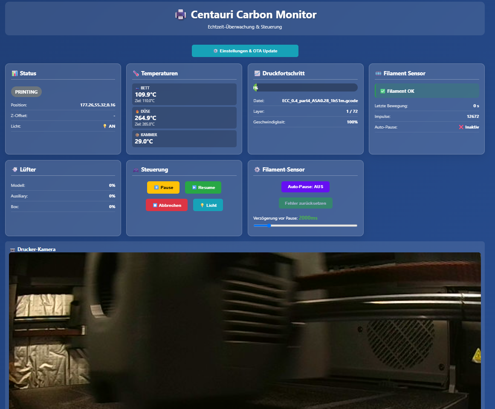

# Centauri Carbon Monitor

ESP32-basierte Überwachungslösung für den Elegoo Centauri Carbon 3D-Drucker mit Filament-Sensor und Web-Dashboard.

Getestet mit der Aktuellen Firmware 1.1.46



## Features

- ✅ **Echtzeit-Druckerüberwachung** via WebSocket
- ✅ **Filament-Runout-Detektion** (Sensor erkennt fehlendes Filament)
- ✅ **Filament-Jam-Detektion** (Motion-Sensor erkennt Verstopfung)
- ✅ **Automatische Pause** bei Filament-Problemen
- ✅ **Web-Dashboard** für Überwachung und Steuerung
- ✅ **REST API** für externe Integrationen

## Hardware

- **ESP32-C3 Super Mini** (oder kompatibel)
- BIGTREETECH Smart Filament Sensor V2.0 oder kompatibel
- **Filament Switch Sensor** (Pin 1) - Erkennt Filament-Präsenz
- **Filament Motion Sensor** (Pin 0) - Erkennt Filament-Bewegung
- **Filament Switch** **Output** zum Drucker

## Modulare Architektur

Das Projekt ist in logische Module aufgeteilt:

### Core Module

- **[config.h](src/config.h)** / **[config.cpp](src/config.cpp)**

  - Pin-Definitionen
  - Timeout-Konfigurationen
- **[main.cpp](src/main.cpp)**

  - Hauptprogramm
  - Initialisierung aller Module
  - Haupt-Loop-Koordination

### Netzwerk-Module

- **[wifi_manager.h](src/wifi_manager.h)** / **[wifi_manager.cpp](src/wifi_manager.cpp)**

  - WiFi-Verbindungsmanagement
  - Automatische Reconnect-Logik
- **[websocket_client.h](src/websocket_client.h)** / **[websocket_client.cpp](src/websocket_client.cpp)**

  - WebSocket-Verbindung zum Drucker
  - Senden von Befehlen
  - Empfangen und Parsen von Status-Updates
- **[web_server.h](src/web_server.h)** / **[web_server.cpp](src/web_server.cpp)**

  - HTTP-Webserver (Port 80)
  - REST API-Endpunkte
  - Dashboard-Bereitstellung

### Drucker-Module

- **[printer_status.h](src/printer_status.h)** / **[printer_status.cpp](src/printer_status.cpp)**

  - PrinterStatus-Struktur
  - Status-Anzeige-Funktionen
  - Verwendet printer_status_codes.h
- **[printer_status_codes.h](src/printer_status_codes.h)**

  - Status-Code-Definitionen (IDLE, PRINTING, PAUSED, etc.)
  - Status-Text-Konvertierung
- **[printer_control.h](src/printer_control.h)** / **[printer_control.cpp](src/printer_control.cpp)**

  - Druckersteuerungsfunktionen
  - startPrint(), pausePrint(), resumePrint(), cancelPrint()
  - toggleLight()

### Sensor-Modul

- **[filament_sensor.h](src/filament_sensor.h)** / **[filament_sensor.cpp](src/filament_sensor.cpp)**
  - Filament-Sensor-Initialisierung
  - Runout-Detection (Switch)
  - Jam-Detection (Motion)
  - Automatische Pause-Logik
  - Interrupt-basierte Motion-Erkennung

### Web-Interface

- **[dashboard.h](src/dashboard.h)**
  - Vollständiges HTML/CSS/JavaScript Dashboard
  - Responsive Design
  - Echtzeit-Updates (500ms)
  - Touch-optimiert

## API-Endpunkte

### GET /

Web-Dashboard (HTML-Oberfläche)

### GET /api/status

Gibt aktuellen Status als JSON zurück:

```json
{
  "status": {
    "state": 11,
    "stateText": "PRINTING",
    "position": "X:120.5 Y:85.3 Z:15.2",
    "zOffset": 0.0,
    "lightOn": true,
    "bedTemp": 60.0,
    "bedTarget": 60.0,
    "nozzleTemp": 220.0,
    "nozzleTarget": 220.0,
    "chamberTemp": 35.0
  },
  "print": {
    "progress": 45,
    "filename": "model.gcode",
    "layer": 150,
    "totalLayers": 300,
    "speed": 100
  },
  "fans": {
    "model": 100,
    "aux": 50,
    "box": 30
  },
  "sensor": {
    "error": false,
    "noFilament": false,
    "lastMotion": 250,
    "pulseCount": 1234,
    "autoPause": true,
    "pauseDelay": 3000
  }
}
```

### POST /api/control

Sendet Steuerungsbefehle:

**Actions:**

- `pause` - Druck pausieren
- `resume` - Druck fortsetzen
- `cancel` - Druck abbrechen
- `toggleLight` - Licht umschalten
- `toggleAutoPause` - Auto-Pause aktivieren/deaktivieren
- `clearError` - Sensor-Fehler zurücksetzen
- `setPauseDelay` - Pause-Verzögerung setzen

**Beispiel:**

```json
{
  "action": "pause"
}
```

## Konfiguration

Beim ersten Start verbinden Sie sich mit dem ESP

Im Browser die Centauri-Monitor-Setup'  Seite aufrufen (http://192.168.4.1)

DIe Daten ihres Routers eingeben

Die IP des Druckers im Netzwerk eingeben.

## Installation

1. VB Code und PlatformIO installieren
2. Repository klonen
3. `config.h` anpassen
4. Kompilieren und hochladen:
   ```bash
   platformio run --target upload
   ```

## Zugriff auf das Dashboard

Nach dem Start und erfolgreicher WiFi-Verbindung:

1. IP-Adresse im Serial Monitor ablesen
2. Browser öffnen: `http://<ESP32-IP-Adresse>`
3. Dashboard wird angezeigt mit Live-Updates

## Status-Codes

| Code | Status   | Beschreibung               |
| ---- | -------- | -------------------------- |
| 0    | IDLE     | Drucker bereit             |
| 1    | HOMING   | Achsen werden referenziert |
| 6    | PAUSED   | Druck pausiert             |
| 11   | PRINTING | Druck läuft               |
| 9    | COMPLETE | Druck abgeschlossen        |

Vollständige Liste in [printer_status_codes.h](src/printer_status_codes.h)

## Dependencies

- **ESP32 Arduino Framework** (^3.2.0)
- **WebSockets** (^2.7.1) - Drucker-Kommunikation
- **ArduinoJson** (^7.4.2) - JSON-Parsing
- **ESPAsyncWebServer** (^3.4.4) - Web-Dashboard

## Entwicklung

### Debug-Ausgaben

Alle Module nutzen den Serial Monitor (115200 baud):

- `[WS]` - WebSocket-Events
- `[SENSOR]` - Filament-Sensor-Events
- `[WEB]` - Webserver-Events

## Lizenz

MIT License

## Credits

Entwickelt für Elegoo Centauri Carbon 3D-Drucker
